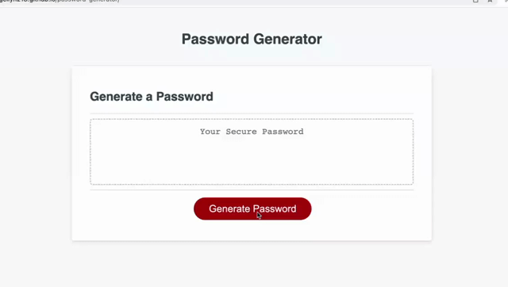

# Password Generator

## Description

Because of the desire for internet privacy, a lot of people require and use passwords to keep their profiles secure. However, it can be difficult to come up with a secure password, especially when a website requires password criteria like a certain length or special characters. In situations like the one previously mentioned, this website is perfect. It can generate a password to fit the required criteria. This website lets the user select the types characters that they want in their password, then will generate a random password with these characters. 

From this project, I learned to apply the skills that I learned in Javascript to this website. I also learned to add new researched elements like the Math.random() function into my code. Moreover, I learned how to be better at pseudocoding so that the build process was smoother. I plan on using these newly learned skills in my future projects.  

## Table of Contents

- [Installation](#installation)
- [Usage](#usage)
- [Code](#code)
- [Credits](#credits)
- [License](#license)
- [Badges](#badges)

## Installation

1. Click on green code button and copy the ssh link
2. Open up terminal or git bash, then navigate to where you want the repository to be placed.
3. Type out "git clone (ssh link)"

## Usage



The best way to use this code is in the form of a website. The easiest way to use it is by opening the website using 'Visual Studio Code'. To do this, right click on the index.html file and click on "Open in Default Browser." You can also open it using [my website](https://angellyn218.github.io/password-generator/).

Once there, you will be greeted by this screen:


Click on the 'Generate Password' button where you will get the prompt:


You can type in the number of characters that you want in the prompt's input box. Once inputed, you will get an alert based on the number of characters that you asked for. If you submit a number less then 8 or more than 128, you will get an alert that sends you back to the generate password screen. This will also happen if you submit a character that is not a number. However, if you choose a number that is between 8 and 128, you will get an alert that says that you were successful.

After pressing ok on the alert, you will then get 4 confirm pop ups in a row that look like this:


The character types that you will be asked to add are 'lowercase letters', 'uppercase letters', 'numeric characters', and 'special characters'. To add that character type to the password, press ok. To not use that character type, press cancel. You must chose at least one character type for the password to be able generate.

Once you have selected the characters that you want to use in the password, the randomly generated password will appear in the box.


## Code

This project contains a lot of different pieces of code to make the website work. One code snippet that I am proud of is the following piece of code:

```
var lower = false;
var upper = false;
var numeric = false;
var special = false;

while (!lower && !upper && !numeric && !special) {
    lower = confirm("Do you want to add LOWERCASE LETTERS to your password?");
    upper = confirm("Do you want to add UPPERCASE LETTERS to your password?");
    numeric = confirm("Do you want to add NUMERIC CHARACTERS to your password?");
    special = confirm("Do you want to add SPECIAL CHARACTERS to your password?");
    
    if (!lower && !upper && !numeric && !special) {
      alert("No characters chosen. Try again.");
    }
}
```
The first part of the code contains 4 different boolean variables. Each variable represents a character type and if that character type can be added to the password. If the variable is true, the character type can be added to the password. If false, the character type will not be added. 

The second part is a while loop. For the while loop to repeat, all values of the 4 boolean variables must be false. If at least one of them is true, the while loop breaks. Within the while loop, the user can confirm which types of characters they want to be added to their generated password. Each confirm returns a boolean value which is stored in the corresponding variable. If no character types were chosen, the function lets the user know with an alert and the while loop is repeated. Once the user choses at least one character type that can be added to the password, the while loop breaks.

## Credits

List of special characters: https://www.owasp.org/index.php/Password_special_characters

Random number: https://www.w3schools.com/js/js_random.asp

Prompt: https://www.w3schools.com/jsref/met_win_prompt.asp

Confirm: https://www.w3schools.com/jsref/met_win_confirm.asp

Alert: https://www.w3schools.com/jsref/met_win_alert.asp

document.querySelector: https://developer.mozilla.org/en-US/docs/Web/API/Document/querySelector

addEventListener: https://developer.mozilla.org/en-US/docs/Web/API/EventTarget/addEventListener

For recording the gif: https://www.screencastify.com/get-started?gclid=CjwKCAjw4c-ZBhAEEiwAZ105RUm9HfoeDhj6eTgCmM2DakyCBTom58uDXoIPm4KrbTEqqQMaBwtteBoCA60QAvD_BwE

## License

Please refer to LICENSE in this repository

## Badges


