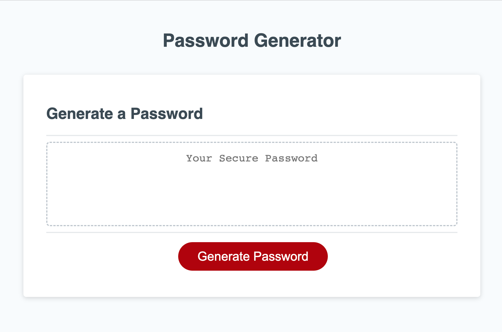
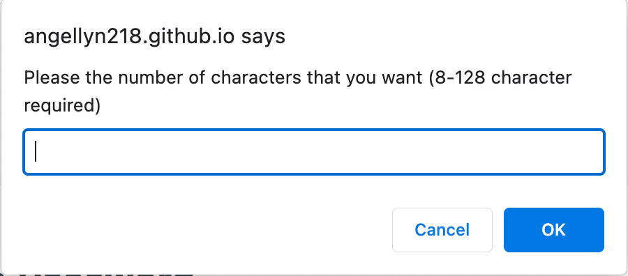
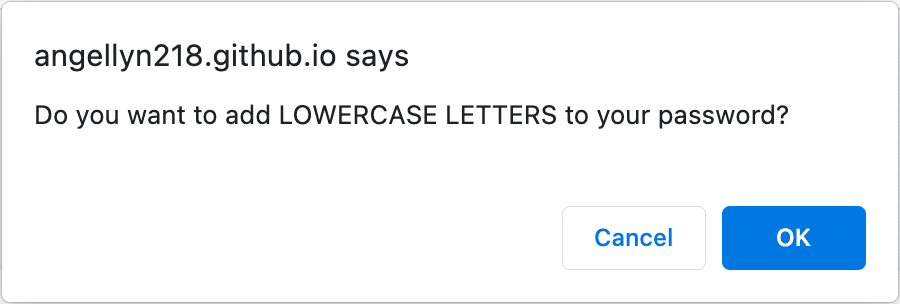

# Password Generator

## Description

Provide a short description explaining the what, why, and how of your project. Use the following questions as a guide:

- What was your motivation?
- Why did you build this project? (Note: the answer is not "Because it was a homework assignment.")
- What problem does it solve?
- What did you learn?

Because of the desire for internet privacy, a lot of people require and use passwords to keep their profiles secure. However, it can be difficult to come up with a secure password, especially when a website requires password criteria like a certain length or special characters. In situations like the one previously mentioned, this website is perfect. It can generate a password to fit the required criteria. This web lets the user select the types characters that they want in their password, then will generate a random password with these characters. 

From this project, I learned to apply the skills that I learned in Javascript to this website. I also learned to add new researched elements like the Math.random() function into my code. I also learned how to better pseudocode so that the building process was smoother. I plan on using these new learned skills in any future project.  

## Table of Contents

- [Installation](#installation)
- [Usage](#usage)
- [Code](#code)
- [Credits](#credits)
- [License](#license)
- [Badges](#badges)

## Installation

1. Click on green code button and copy the ssh link
2. Open up terminal or git bash, then navigate to where you want the repository to be placed.
3. Type out "git clone (ssh link)"

## Usage

The best way to use this code is as it is designed as: a random password generator. The easiest way to use it is by opening the website using VS Code. To do this, right click on the index.html file and click on "Open in Default Browser." You can also open it using [my website](https://angellyn218.github.io/password-generator/).

Once there, you will be greeted by this screen:



Click on the 'Generate Password' button where you will get the prompt:



You can type in the number of characters that you want in the prompt's input box. Once inputed, you will get an alert based on the number of characters that you asked for. 

After pressing ok on the alert, you will then get 4 confirm pop ups in a row that look like this:



The character types that you will be asked to add are 'lowercase letters', 'uppercase letters', 'numeric characters', and 'special characters'. To add that character type to the password, press ok. To not use that character type, press cancel. You must chose at least one character type for the password to be able generate.

Once you have selected the characters that you want to use in the password, the randomly generated password will appear in the box.


## Code

This project contain a lot of different pieces of code to make the website work. One code snippet that I am proud of is the following piece of code:

```
var lower = false;
var upper = false;
var numeric = false;
var special = false;

while (!lower && !upper && !numeric && !special) {
    lower = confirm("Do you want to add LOWERCASE LETTERS to your password?");
    upper = confirm("Do you want to add UPPERCASE LETTERS to your password?");
    numeric = confirm("Do you want to add NUMERIC CHARACTERS to your password?");
    special = confirm("Do you want to add SPECIAL CHARACTERS to your password?");
    
    if (!lower && !upper && !numeric && !special) {
      alert("No characters chosen. Try again.");
    }
}
```

This code snippet asks the user to confirm which character types they want to add. However, they need to select at least one character type. If a character type is not chosen, then the while loop will force the user to choose character types again.

## Credits

List of special characters: https://www.owasp.org/index.php/Password_special_characters

Random number: https://www.w3schools.com/js/js_random.asp

Prompt: https://www.w3schools.com/jsref/met_win_prompt.asp

Confirm: https://www.w3schools.com/jsref/met_win_confirm.asp

Alert: https://www.w3schools.com/jsref/met_win_alert.asp

document.querySelector: https://developer.mozilla.org/en-US/docs/Web/API/Document/querySelector

addEventListener: https://developer.mozilla.org/en-US/docs/Web/API/EventTarget/addEventListener

## License

Please refer to LICENSE in this repository

## Badges


